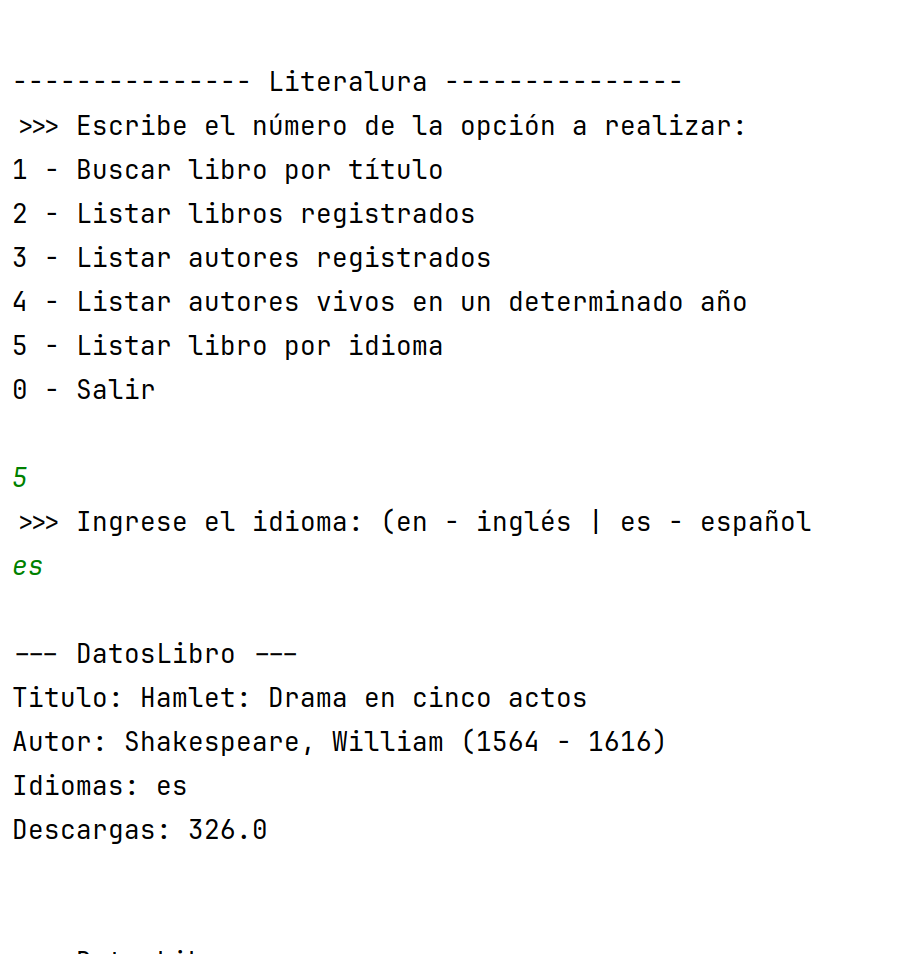

# LiterAlura

## Tabla de Contenidos
- [Sobre el Proyecto](#sobre-el-proyecto)
- [Construido con](#construido-con)
- [Primeros Pasos](#primeros-pasos)
    - [Requisitos Previos](#requisitos-previos)
    - [Instalación](#instalación)
- [Uso](#uso)
- [Ejemplos](#ejemplos)

---

## Sobre el Proyecto

<div align="center" padding="20">

</div>
**LiterAlura** es una aplicación de terminal que permite buscar y gestionar información sobre libros utilizando la API [Gutendex](https://gutendex.com/) y almacena los datos obtenidos en una base de datos PostgreSQL. El sistema ofrece un menú interactivo para realizar diversas operaciones relacionadas con libros y autores.

### Características Principales:
- Menú interactivo para realizar diversas consultas y operaciones.
- Obtención de datos en tiempo real desde la API de Gutendex.
- Conversión automática de los datos JSON a modelos de Java mediante Jackson.
- Persistencia de datos utilizando JPA con PostgreSQL.
- Código modular, sencillo y escalable.

---

## Construido con

- **Java 17**: Lenguaje principal de programación.
- **Spring Boot**: Framework para desarrollo de aplicaciones basadas en Java.
- **Jackson**: Biblioteca para la serialización/deserialización de datos JSON.
- **JPA**: Abstracción para consultas a bases de datos.
- **PostgreSQL**: Base de datos relacional para almacenamiento persistente.
- **Lombok**: Simplificación del código boilerplate en Java.

---

## Primeros Pasos

Para obtener una copia local en funcionamiento, sigue estos pasos.

### Requisitos Previos

Asegúrate de tener instalado lo siguiente en tu sistema:
- Java Development Kit (JDK) 17 o superior.
- Maven para la gestión de dependencias.
- PostgreSQL configurado y corriendo localmente.

### Instalación

1. Clona el repositorio e instala las dependencias:
   ```bash
   git clone https://github.com/tu-repositorio/literalura.git
   cd literalura
   mvn install
   ```

2. Configura las credenciales de tu base de datos PostgreSQL en el archivo `application.properties`:
   ```properties
   spring.datasource.url=jdbc:postgresql://localhost:5432/nombre_base_datos
   spring.datasource.username=tu_usuario
   spring.datasource.password=tu_contraseña
   ```

3. Construye el proyecto:
   ```bash
   mvn package
   ```

---

## Uso

1. Inicia la aplicación desde tu terminal:
   ```bash
   java -jar target/literalura.jar
   ```

2. En el menú principal selecciona una opción ingresando el número correspondiente y sigue las instrucciones en 
   pantalla.
---

## Ejemplos

### 1. Buscar libro por título:
La aplicación pedirá el título del libro y buscará los resultados en la API de Gutendex. Los resultados se procesan 
y se muestran en la terminal:


### 2. Listar libros y autores registrados:
Muestra todos los libros almacenados en la base de datos local (opción 2) y los autores (opción 3):


### 3. Listar autores vivos en un determinado año:
La aplicación pedirá un año y mostrará todos los autores que estaban vivos en ese periodo o un mensaje si no hay 
datos de autores en ese periodo:


### 4. Listar libros por idioma:
Muestra libros registrados filtrados por el idioma especificado en inglés o español:


